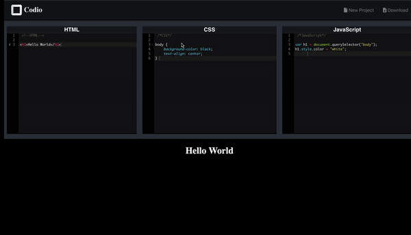

# Codio- An online IDE with real time rendering

This is a ReactJS Single Page Application.

 

You can view a hosted instance of Codio [here](https://abdamin.github.io/codio/)

# Set up locally

    $ git clone https://github.com/abdamin/codio.git
    $ cd client
    $ npm install //install client dependencies
    $ npm run buid
    $ npm start

# App Info

Author: Abdullah Amin

License: MIT
